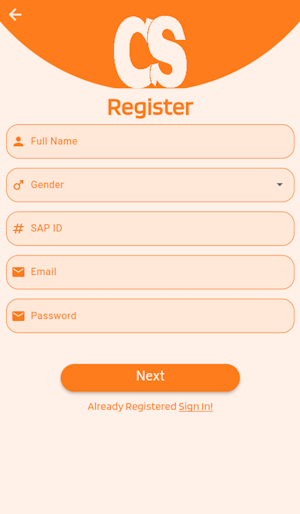

# College Space

The purpose of the College Space is to revolutionize and elevate the academic experience of college students in the digital era. Recognizing the transformative potential of technology in higher education, our project aims to create a cutting-edge mobile application that empowers students by providing a seamless platform for collaborative learning, resource sharing, and efficient schedule coordination. Some of the primary objectives are:

- **Enhance Learning Journey:**
  To empower students with tools that go beyond traditional learning methods, fostering an enriched and dynamic academic experience.

- **Seamless Resource Sharing:**
  To establish a robust system for students to share and access high-quality study materials, notes, and resources related to their courses.

- **Interactive Group Engagement:**
  To promote collaborative learning by facilitating the formation of study groups, enabling students to engage in meaningful discussions and knowledge exchange.

- **Efficient Schedule Coordination:**
  To streamline the process of updating and viewing course timetables, allowing students to propose and approve schedule modifications for better coordination.

- **Cross-Platform Accessibility:**
  To ensure inclusivity and accessibility, by developing an application compatible with both Android and iOS devices, adaptable to various screen resolutions.

**Note-** This project is currently under development, current progress is shown below.

## Features

## Technologies Using

### Flutter

Flutter is an open-source UI software development kit created by Google. It is used to develop cross platform applications from a single codebase for any web browser, Android, iOS, Linux, macOS, and Windows. We used it to create UI of our application and make our application can be released on multiple platforms.

### Dart

Dart is a programming language developed by Google. The programming language can be used to develop web and mobile apps as well as server and desktop applications. It is the programming language used by flutter to write UI code and logic behind the UI.

### Firebase

Firebase, is a set of backend cloud computing services and application development platforms provided by Google. It hosts databases, services, authentication, and integration for a variety of applications, including Android, iOS, JavaScript, Node.js, Java, Unity, PHP, and C++. It will be used as backend for our application.

### Figma

Figma is a collaborative web application for interface design, with additional offline features enabled by desktop applications for macOS and Windows. The feature set of Figma focuses on user interface and user experience design, with an emphasis on real-time collaboration, utilizing a variety of vector graphics editor and prototyping tools. We used it to design and create a prototype of application.

## Current Progress

### Check Update Screen/Splash Screen

### Login Screen

### Registration Screen

**Note-** Connecting to Firebase is also done.
